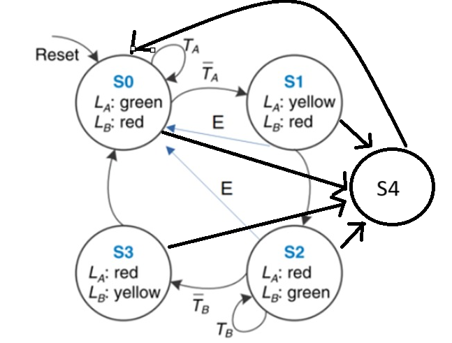
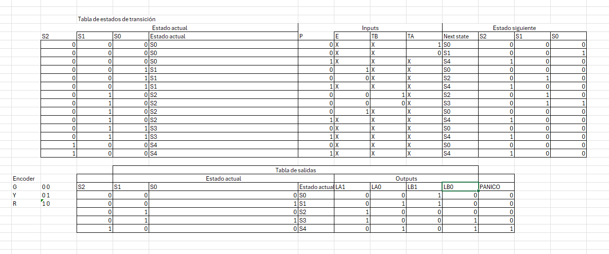

# Sem-foro
Descripción del Proyecto
Este proyecto implementa un sistema de semáforo en una placa Basys utilizando SystemVerilog. El sistema de semáforo incluye una funcionalidad especial: un botón de pánico. Al activar el botón de pánico, todos los semáforos se ponen en estado amarillo y se enciende un LED de pánico para indicar la emergencia.

Características del Proyecto
Sistema de semáforo básico:
Control de tráfico para dos vías: Avenida Academic y Bulevard Bravado.
Estados del semáforo: verde, amarillo y rojo.
Botón de pánico:
Al presionar el botón de pánico, todos los semáforos se ponen en amarillo.
Se enciende un LED de pánico para indicar el estado de emergencia.

Estados del Semáforo

S0 (Verde en Avenida Academic)
S1 (Amarillo en Avenida Academic)
S2 (Verde en Bulevard Bravado)
S3 (Amarillo en Bulevard Bravado)
S4 (Panico)

Entradas y Salidas

Entradas
TA: Gente circulando en Avenida Academic
TB: Gente circulando en Bulevard Bravado
E: Emergencia
P: Panico

Salidas
LA1
LA0
LB1
LB0
P

Instrucciones de Uso
Conectar la placa Basys al ordenador.
Programar la placa con el archivo SystemVerilog correspondiente.
Ejecutar el sistema y observar el comportamiento del semáforo.
Presionar el botón de pánico para activar la emergencia y verificar que todos los semáforos se pongan en amarillo y el LED de pánico se encienda.

Analisis
Análisis de la Simulación
Aunque la simulación se realizó de manera apresurada, los resultados demostraron que el sistema funcionó tal y como se esperaba. La implementación del botón de pánico es una característica crucial para situaciones de emergencia, ya que permite que todos los semáforos se pongan en amarillo y se active un LED de pánico. Esto puede ayudar a prevenir accidentes y proteger a las personas en peligro al detener el tráfico y alertar a los conductores y peatones de la emergencia.

Funcionamiento del Botón de Pánico
Estado Amarillo Universal: Al presionar el botón de pánico, todos los semáforos cambian inmediatamente al estado amarillo, alertando a los conductores de detenerse y ceder el paso.
LED de Pánico: La activación del LED de pánico proporciona una señal visual adicional para indicar que se ha producido una situación de emergencia.
Beneficios de Seguridad: Esta característica mejora la seguridad vial al proporcionar una respuesta rápida y efectiva en situaciones de emergencia, ayudando a proteger a los peatones y conductores.

Contribuciones
Este proyecto fue desarrollado por Luis David Serrano Conde. Si tienes alguna pregunta o sugerencia, no dudes en contactar.
